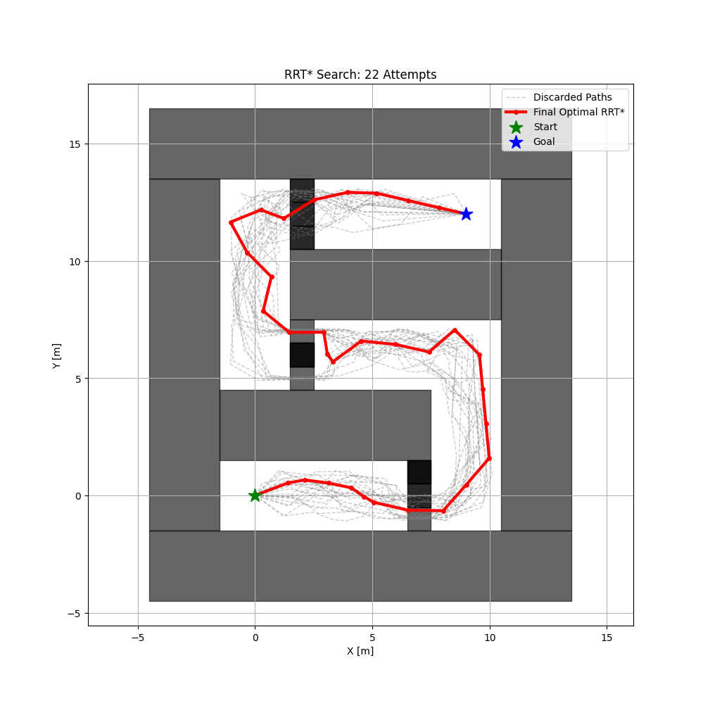

# RO47005 Planning and Dicision Making Project

## Original Framework

This project is based on the gym-pybullet-drones framework.
For a full description of the simulation environment, installation
instructions, and baseline controllers, please refer to the original
repository:

https://github.com/utiasDSL/gym-pybullet-drones

## Contributors

**Group:** 34  
**Submission date:** 12/01/2026

<table>
  <tr>
    <td>

| Name              | NetID       | Student Number |
|-------------------|-------------|----------------|
| Simone Pigliapoco | spigliapoco | 6403344        |
| Tommaso Calzolari | tcalzolari  | 6430600        |
| Leonardo Pedretti | lpedretti   | 6432891        |
| Kevin Stehouwer   | kstehouwer  | 6304915        |

  </td>
  <td style="vertical-align: middle; padding-left: 20px;">
    
  </td>
  </tr>
</table>

---

## About

This repository contains a complete path planning pipeline for group 34 of the RO47005 'Planning and Dicision Making' course project. The objective of the project is to autonomously navigate a quadrotor from a start location (A) to a goal location (B) in a three-dimensional environment containing static obstacles, by computing and tracking a collision-free trajectory. See figure 1 for a demo:

<p align="center">
  
  <br>
  <em>Figure 1: Global path planning using RRT* (left) and local trajectory tracking with MPC (right).</em>
</p>


 This repository extends and builds upon the forked repository `gym_pybullet_drones` which includes the base of the environent and quadrotor dynamics. Furthermore, for the objective stated above, the incremental sampling-based method Rapidly-exploring Random Tree (`RRT.py`, figure 2) will be used for global path planning, since it performs well in high-dimensional configuration spaces and provides asymptotic optimality and probabilistic completeness as the number of iterations approaches infinity, meaning that the probability of finding a feasible path approaches one if such a path exists, and that the cost of the solution converges to the optimal solution over time. However, for this project, a variant of RRT* has been used to speed up the path planning process by returning the first feasible path found. By doing this, as the number of iterations approaches infinity, the probability of finding a feasible path still approaches one if such a path exists but, the cost of the solution does not converge to the optimal solution over time since it does not update the path after finding the first feasible solution. In addition, Model Predictive Control (`MPC.py`, figure 2) will be used for local path planning, as it enables to avoid encountered obstacles during flight. MPC plans over a finite prediction horizon, explicitly handles constraints, and recomputes the control inputs at each time step based on updated state information, meaning that it is perfectly suited for the objective. 
 
<p align="center">
  
  
  <br>
  <em>Figure 2: Global path planning using RRT* (left) and local trajectory tracking with MPC (right).</em>
</p>
 
 The environment of py-bullet-drones has been extended by placing obstacles which the quadrotor has to avoid in `env.py`. Finally, to combine the methods in a complete pipeline, `main.py` has been developed.

---

## Installation 

To install the repository, including `gym_pybullet_drones` and the path planning files, find a place in your directory to store and enter the following commands in your terminal:
```sh
git clone https://github.com/KevinStehouwer211/RO47005-PDM-Project.git
cd RO47005-PDM-Project/

conda create -n drones python=3.10
conda activate drones

pip3 install --upgrade pip
pip3 install -e . # if needed, `sudo apt install build-essential` to install `gcc` and build `pybullet`

# check installed packages with `conda list`, deactivate with `conda deactivate`, remove with `conda remove -n drones --all`
```

---

## Run path planning pipeline 

once everything is set up, you can run the path planning pipeline of the quadrotor by using the following command in the terminal:
```sh
conda activate drones
cd PDM_project/
python3 main.py
```

Initially, the script will attempt to find a feasible path which will navigate to the goal position without collisions and errors recarding the quadrotors dynamics. Eventually, after finding a feasible path, you should be able to see the simulation environment including the quadrotor. A red and green line have been displayed which represent the offline planned RRT* path and smoothened spline path after applying quadrotor dynamics. While tracking the offline computed RRT* path, the quadrotor will encounter randomly placed obstacles on its path which it will have to avoid by using online MPC obstacle avoidance while remaining as close as possible to the planned path. After reaching the goal, the script will output graphs which demonstrate data and actions taken by the quadrotor.

--- 

## Citation

This project is based on the open-source framework
**gym-pybullet-drones** by Panerati et al.

If you use the original simulation environment, please cite:

> Panerati, J., Zheng, H., Zhou, S., Xu, J., Prorok, A., & Schoellig, A. P.  
> *Learning to Fly—A Gym Environment with PyBullet Physics for Reinforcement Learning of Multi-agent Quadcopter Control*,  
> IEEE/RSJ IROS, 2021.

The extensions contained in the `PDM_project/` folder, including the
RRT* global planner and MPC-based local controller, were developed as
part of the TU Delft course **RO47005 – Planning and Decision Making**.

---

## References
- Erwin Coumans and Yunfei Bai (2023) [*PyBullet Quickstart Guide*](https://docs.google.com/document/d/10sXEhzFRSnvFcl3XxNGhnD4N2SedqwdAvK3dsihxVUA/edit?tab=t.0#heading=h.2ye70wns7io3)
- Carlos Luis and Jeroome Le Ny (2016) [*Design of a Trajectory Tracking Controller for a Nanoquadcopter*](https://arxiv.org/pdf/1608.05786.pdf)
- Nathan Michael, Daniel Mellinger, Quentin Lindsey, Vijay Kumar (2010) [*The GRASP Multiple Micro-UAV Testbed*](https://ieeexplore.ieee.org/document/5569026)
- Benoit Landry (2014) [*Planning and Control for Quadrotor Flight through Cluttered Environments*](http://groups.csail.mit.edu/robotics-center/public_papers/Landry15)
- Julian Forster (2015) [*System Identification of the Crazyflie 2.0 Nano Quadrocopter*](https://www.research-collection.ethz.ch/handle/20.500.11850/214143)
- Antonin Raffin, Ashley Hill, Maximilian Ernestus, Adam Gleave, Anssi Kanervisto, and Noah Dormann (2019) [*Stable Baselines3*](https://github.com/DLR-RM/stable-baselines3)
- Guanya Shi, Xichen Shi, Michael O’Connell, Rose Yu, Kamyar Azizzadenesheli, Animashree Anandkumar, Yisong Yue, and Soon-Jo Chung (2019)
[*Neural Lander: Stable Drone Landing Control Using Learned Dynamics*](https://arxiv.org/pdf/1811.08027.pdf)
- C. Karen Liu and Dan Negrut (2020) [*The Role of Physics-Based Simulators in Robotics*](https://www.annualreviews.org/doi/pdf/10.1146/annurev-control-072220-093055)
- Yunlong Song, Selim Naji, Elia Kaufmann, Antonio Loquercio, and Davide Scaramuzza (2020) [*Flightmare: A Flexible Quadrotor Simulator*](https://arxiv.org/pdf/2009.00563.pdf)

-----
> University of Toronto's [Dynamic Systems Lab](https://github.com/utiasDSL) / [Vector Institute](https://github.com/VectorInstitute) / University of Cambridge's [Prorok Lab](https://github.com/proroklab)

<!--
## WIP/Desired Contributions/PRs

- [ ] Multi-drone `crazyflie-firmware` SITL support
- [ ] Use SITL services with steppable simulation
- [ ] Add motor delay, advanced ESC modeling by implementing a buffer in `BaseAviary._dynamics()`
- [ ] Replace `rpy` with quaternions (and `ang_vel` with body rates) by editing `BaseAviary._updateAndStoreKinematicInformation()`, `BaseAviary._getDroneStateVector()`, and the `.computeObs()` methods of relevant subclasses

## Troubleshooting

- On Ubuntu, with an NVIDIA card, if you receive a "Failed to create and OpenGL context" message, launch `nvidia-settings` and under "PRIME Profiles" select "NVIDIA (Performance Mode)", reboot and try again.
-->
